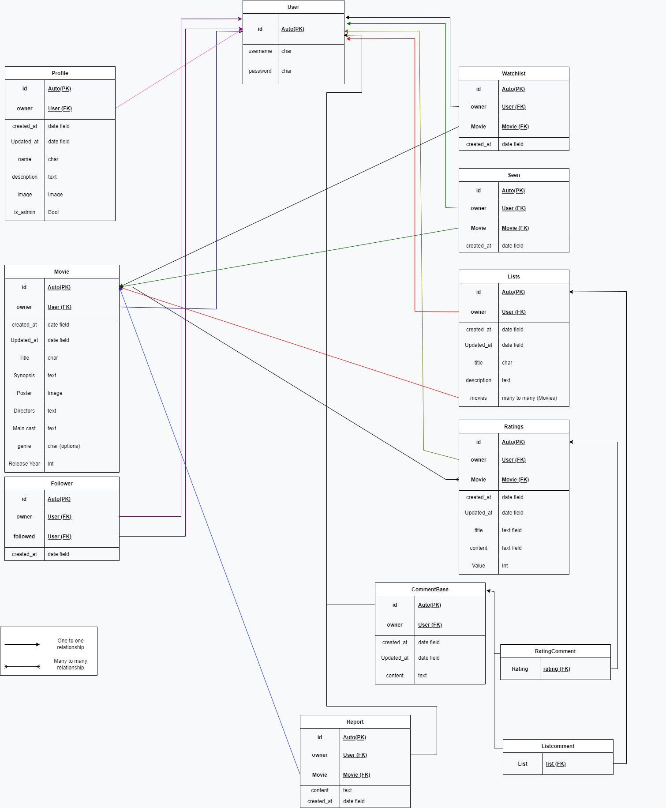
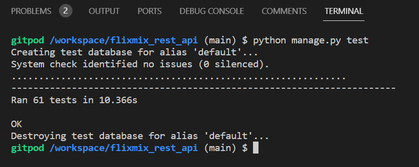

# FlixMix API in DRF

[Live link](https://agustin-cilli-flixmix-api.herokuapp.com/)

This code repository hosts the collection of APIs implemented with Django REST Framework, specifically designed to support the functionality of the FlixMix application's user interface. ([repository here](https://github.com/cilliagustin/flixmix) and [live website here](https://agustin-cilli-flixmix.herokuapp.com/))

## User Stories
[Click Here](https://github.com/users/cilliagustin/projects/4) to open the GitHub kanban Board and see all stories.
The backend segment of the project primarily emphasizes its administrative aspect and encompasses two user stories:
- User story: Admin control of database
    - As an Admin, I can edit or delete any movie uploaded to the database as well as the lists reviews and comments created by the users to control the database posted and avoid inappropriate content
- User story: View and Delete reports:
    - As an Admin, I can view and delete reports created by users so that i can be aware of possible errors or innapropiate content and act accordingly

## Database
The subsequent models were designed to depict the structural layout of the application's database model:

View diagram

#### User Model
- The User model is a base model that comes by default with the django auth module

#### Profile Model
- Fk relation user model
- Stores the following information: created_at, updated_at, name, description (bio of the user) image and is_admin (Boolean only true for administrator profiles)

#### Movie Model
- Fk relation user model
- Stores the following information: created_at, updated_at, title, synopsis, poster, main_cast, directors genre and release_year

#### Rating Model
- Fk relation user model
- Fk relation movie model
- Stores the following information: created_at, updated_at, title, content, value

#### List Model
- Fk relation user model
- Many to many relation with movie model
- Stores the following information: created_at, updated_at, title, description

#### CommentBase Model
- Fk relation user model
- Stores the following information: created_at, updated_at, content

#### ListComment Model
- Inherits from CommentBase
- Fk relation List model

#### RatingComment Model
- Inherits from CommentBase
- Fk relation Rating model

#### Seen Model
- Fk relation user model
- Fk relation movie model
- Stores the following information: created_at

#### Watchlist Model
- Fk relation user model
- Fk relation movie model
- Stores the following information: created_at

#### Follower Model
- Fk relation between the owner field and the User model id field
- Fk relation between the followed field and the User model post field
- Stores the following information: created_at

#### Report Model
- Fk relation user model
- Fk relation movie model
- Stores the following information: created_at, content

## Technologies Used

### Languages & Frameworks

- Python
- Django

### Libraries & Tools

- [Cloudinary](https://cloudinary.com/) to store static files
- [Coverage](https://coverage.readthedocs.io/en/6.4.4/) used to produce automated testing report
- [Dbdiagram.io](https://dbdiagram.io/home) used for the database schema diagram
- [Git](https://git-scm.com/) was used for version control 
- [GitHub](https://github.com/) was used as a remote repository to store project code
- [Gitpod)](https://gitpod.io/workspaces) - a virtual IDE workspace used to build this site
- [Heroku](https://heroku.com) was used to deploy the project into live environment
- [Django REST Framework](https://www.django-rest-framework.org/) was used to build the back-end API
- [Django AllAuth](https://django-allauth.readthedocs.io/en/latest/index.html) was used for user authentication

## Validation:
I have used the recommended [CI Python Linter](https://pep8ci.herokuapp.com) to validate all of my Python files.

| File | URL |
| --- | --- |
| Flixmix_rest_api permissions | https://pep8ci.herokuapp.com/https://raw.githubusercontent.com/cilliagustin/flixmix_rest_api/main/flixmix_rest_api/permissions.py |
| Flixmix_rest_api serializers | https://pep8ci.herokuapp.com/https://raw.githubusercontent.com/cilliagustin/flixmix_rest_api/main/flixmix_rest_api/serializers.py |
| Flixmix_rest_api settings | https://pep8ci.herokuapp.com/https://raw.githubusercontent.com/cilliagustin/flixmix_rest_api/main/flixmix_rest_api/settings.py |
| Flixmix_rest_api urls | https://pep8ci.herokuapp.com/https://raw.githubusercontent.com/cilliagustin/flixmix_rest_api/main/flixmix_rest_api/urls.py |

| File | URL |
| --- | --- |
| Utils Choices | https://pep8ci.herokuapp.com/https://raw.githubusercontent.com/cilliagustin/flixmix_rest_api/main/utils/choices.py |

| File | URL |
| --- | --- |
| Comments admin | https://pep8ci.herokuapp.com/https://raw.githubusercontent.com/cilliagustin/flixmix_rest_api/main/comments/admin.py |
| Comments models | https://pep8ci.herokuapp.com/https://raw.githubusercontent.com/cilliagustin/flixmix_rest_api/main/comments/models.py |
| Comments serializers | https://pep8ci.herokuapp.com/https://raw.githubusercontent.com/cilliagustin/flixmix_rest_api/main/comments/serializers.py |
| Comments urls | https://pep8ci.herokuapp.com/https://raw.githubusercontent.com/cilliagustin/flixmix_rest_api/main/comments/urls.py |
| Comments views | https://pep8ci.herokuapp.com/https://raw.githubusercontent.com/cilliagustin/flixmix_rest_api/main/comments/views.py |
| Comments tests | https://pep8ci.herokuapp.com/https://raw.githubusercontent.com/cilliagustin/flixmix_rest_api/main/comments/tests.py |

| File | URL |
| --- | --- |
| Followers admin | https://pep8ci.herokuapp.com/https://raw.githubusercontent.com/cilliagustin/flixmix_rest_api/main/followers/admin.py |
| Followers models | https://pep8ci.herokuapp.com/https://raw.githubusercontent.com/cilliagustin/flixmix_rest_api/main/followers/models.py |
| Followers serializers | https://pep8ci.herokuapp.com/https://raw.githubusercontent.com/cilliagustin/flixmix_rest_api/main/followers/serializers.py |
| Followers urls | https://pep8ci.herokuapp.com/https://raw.githubusercontent.com/cilliagustin/flixmix_rest_api/main/followers/urls.py |
| Followers views | https://pep8ci.herokuapp.com/https://raw.githubusercontent.com/cilliagustin/flixmix_rest_api/main/followers/views.py |
| Followers tests | https://pep8ci.herokuapp.com/https://raw.githubusercontent.com/cilliagustin/flixmix_rest_api/main/followers/tests.py |

| File | URL |
| --- | --- |
| Lists admin | https://pep8ci.herokuapp.com/https://raw.githubusercontent.com/cilliagustin/flixmix_rest_api/main/lists/admin.py |
| Lists models | https://pep8ci.herokuapp.com/https://raw.githubusercontent.com/cilliagustin/flixmix_rest_api/main/lists/models.py |
| Lists serializers | https://pep8ci.herokuapp.com/https://raw.githubusercontent.com/cilliagustin/flixmix_rest_api/main/lists/serializers.py |
| Lists urls | https://pep8ci.herokuapp.com/https://raw.githubusercontent.com/cilliagustin/flixmix_rest_api/main/lists/urls.py |
| Lists views | https://pep8ci.herokuapp.com/https://raw.githubusercontent.com/cilliagustin/flixmix_rest_api/main/lists/views.py |
| Lists tests | https://pep8ci.herokuapp.com/https://raw.githubusercontent.com/cilliagustin/flixmix_rest_api/main/lists/tests.py |

| File | URL |
| --- | --- |
| Movies admin | https://pep8ci.herokuapp.com/https://raw.githubusercontent.com/cilliagustin/flixmix_rest_api/main/movies/admin.py |
| Movies models | https://pep8ci.herokuapp.com/https://raw.githubusercontent.com/cilliagustin/flixmix_rest_api/main/movies/models.py |
| Movies serializers | https://pep8ci.herokuapp.com/https://raw.githubusercontent.com/cilliagustin/flixmix_rest_api/main/movies/serializers.py |
| Movies urls | https://pep8ci.herokuapp.com/https://raw.githubusercontent.com/cilliagustin/flixmix_rest_api/main/movies/urls.py |
| Movies views | https://pep8ci.herokuapp.com/https://raw.githubusercontent.com/cilliagustin/flixmix_rest_api/main/movies/views.py |
| Movies tests | https://pep8ci.herokuapp.com/https://raw.githubusercontent.com/cilliagustin/flixmix_rest_api/main/movies/views.py |

| File | URL |
| --- | --- |
| Profiles admin | https://pep8ci.herokuapp.com/https://raw.githubusercontent.com/cilliagustin/flixmix_rest_api/main/profiles/admin.py |
| Profiles models | https://pep8ci.herokuapp.com/https://raw.githubusercontent.com/cilliagustin/flixmix_rest_api/main/profiles/models.py |
| Profiles serializers | https://pep8ci.herokuapp.com/https://raw.githubusercontent.com/cilliagustin/flixmix_rest_api/main/profiles/serializers.py |
| Profiles urls | https://pep8ci.herokuapp.com/https://raw.githubusercontent.com/cilliagustin/flixmix_rest_api/main/profiles/urls.py |
| Profiles views | https://pep8ci.herokuapp.com/https://raw.githubusercontent.com/cilliagustin/flixmix_rest_api/main/profiles/views.py |

| File | URL |
| --- | --- |
| Ratings admin | https://pep8ci.herokuapp.com/https://raw.githubusercontent.com/cilliagustin/flixmix_rest_api/main/ratings/admin.py |
| Ratings models | https://pep8ci.herokuapp.com/https://raw.githubusercontent.com/cilliagustin/flixmix_rest_api/main/ratings/models.py |
| Ratings serializers | https://pep8ci.herokuapp.com/https://raw.githubusercontent.com/cilliagustin/flixmix_rest_api/main/ratings/serializers.py |
| Ratings urls | https://pep8ci.herokuapp.com/https://raw.githubusercontent.com/cilliagustin/flixmix_rest_api/main/ratings/urls.py |
| Ratings views | https://pep8ci.herokuapp.com/https://raw.githubusercontent.com/cilliagustin/flixmix_rest_api/main/ratings/views.py |
| Ratings tests | https://pep8ci.herokuapp.com/https://raw.githubusercontent.com/cilliagustin/flixmix_rest_api/main/ratings/tests.py |

| File | URL |
| --- | --- |
| Reports admin | https://pep8ci.herokuapp.com/https://raw.githubusercontent.com/cilliagustin/flixmix_rest_api/main/reports/admin.py |
| Reports models | https://pep8ci.herokuapp.com/https://raw.githubusercontent.com/cilliagustin/flixmix_rest_api/main/reports/models.py |
| Reports serializers | https://pep8ci.herokuapp.com/https://raw.githubusercontent.com/cilliagustin/flixmix_rest_api/main/reports/serializers.py |
| Reports urls | https://pep8ci.herokuapp.com/https://raw.githubusercontent.com/cilliagustin/flixmix_rest_api/main/reports/urls.py |
| Reports views | https://pep8ci.herokuapp.com/https://raw.githubusercontent.com/cilliagustin/flixmix_rest_api/main/reports/views.py |

| File | URL |
| --- | --- |
| Seen Movie admin | https://pep8ci.herokuapp.com/https://raw.githubusercontent.com/cilliagustin/flixmix_rest_api/main/seen_movie/admin.py |
| Seen Movie models | https://pep8ci.herokuapp.com/https://raw.githubusercontent.com/cilliagustin/flixmix_rest_api/main/seen_movie/models.py |
| Seen Movie serializers | https://pep8ci.herokuapp.com/https://raw.githubusercontent.com/cilliagustin/flixmix_rest_api/main/seen_movie/serializers.py |
| Seen Movie urls | https://pep8ci.herokuapp.com/https://raw.githubusercontent.com/cilliagustin/flixmix_rest_api/main/seen_movie/urls.py |
| Seen Movie views | https://pep8ci.herokuapp.com/https://raw.githubusercontent.com/cilliagustin/flixmix_rest_api/main/seen_movie/views.py |

| File | URL |
| --- | --- |
| Watchlist admin | https://pep8ci.herokuapp.com/https://raw.githubusercontent.com/cilliagustin/flixmix_rest_api/main/watchlist/admin.py |
| Watchlist models | https://pep8ci.herokuapp.com/https://raw.githubusercontent.com/cilliagustin/flixmix_rest_api/main/watchlist/models.py |
| Watchlist serializers | https://pep8ci.herokuapp.com/https://raw.githubusercontent.com/cilliagustin/flixmix_rest_api/main/watchlist/serializers.py |
| Watchlist urls | https://pep8ci.herokuapp.com/https://raw.githubusercontent.com/cilliagustin/flixmix_rest_api/main/watchlist/urls.py |
| Watchlist views | https://pep8ci.herokuapp.com/https://raw.githubusercontent.com/cilliagustin/flixmix_rest_api/main/watchlist/views.py |

### Django Testing
APITestCase was used to test the functionalities of the main apps: [Comments](./comments/tests.py), [Followers](./followers/tests.py), [Lists](./lists/tests.py), [Movies](./movies/tests.py) and [Ratings](./ratings/tests.py).

This tests all passed without issues.

### Manual testing of user stories

- As an admin, I am able to create, read, update and delete profiles, movies, lists, ratings, comments, followers, seen movies or watchlist movies and reports to control all content in the website.

**Test** | **Action** | **Expected Result** | **Actual Result**
-------- | ------------------- | ------------------- | -----------------
Comments | Create, read, update & delete comment | A comment can be created, read, edited or deleted | Works as expected
Followers | Create & delete follower | A follower can be created or deleted | Works as expected
Lists | Create, read, update & delete list | A list can be created, read edited or deleted | Works as expected
Movies | Create, read, update & delete movie | A movie can be created, read, edited or deleted | Works as expected
Profile | Create, read update & delete profile | A profile can be created, read, edited or deleted | Works as expected
Ratings | Create, read, update & delete ratings | A rating can be created, read, edited or deleted | Works as expected
Report | Create, read & delete report | A report can be created read or deleted | Works as expected
Seen_movie | Create read, & delete seen movie | A movie can be marked as seen, read and this can be deleted | Works as expected
Watchlist | Create, read & delete movie in the watchlist | A movie can be added to the watchlist read and this can be deleted | Works as expected

In addition, comments, dollowing, lists, profies, ratings, seen_movies and watchlist can be created by logged-in users only. Users can only update or delete the content which was created by themselves.
Movies can only be edited or deleted by an admin and Reports can only be deleted by an admin.

## Deployment

### Forking the GitHub Repository

1. Go to [the project repository](https://github.com/cilliagustin/flixmix_rest_api)
2. In the right most top menu, click the "Fork" button.
3. There will now be a copy of the repository in your own GitHub account.

### Making a local clone

1. Go to [the project repository](https://github.com/cilliagustin/flixmix_rest_api)
2. Click on the "Code" button.
3. Choose one of the three options (HTTPS, SSH or GitHub CLI) and then click copy.
4. Open the terminal in you IDE program.
5. Type `git clone` and paste the URL that was copied in step 3.
6. Press Enter and the local clone will be created.

### Alternatively by using Gitpod:

1. Go to [the project repository](https://github.com/cilliagustin/flixmix_rest_api)
2. Click the green button that says "Gitpod" and the project will now open up in Gitpod.

### Deploying with Heroku

I followed the below steps using the Code Institute tutorial:

The following command in the Gitpod CLI will create the relevant files needed for Heroku to install your project dependencies `pip3 freeze --local > requirements.txt`. Please note this file should be added to a .gitignore file to prevent the file from being committed.

1. Go to [Heroku.com](https://dashboard.heroku.com/apps) and log in; if you do not already have an account then you will need to create one.
2. Click the `New` dropdown and select `Create New App`.
3. Enter a name for your new project, all Heroku apps need to have a unique name, you will be prompted if you need to change it.
4. Select the region you are working in.

#### Heroku Settings  
You will need to set your Environment Variables - this is a key step to ensuring your application is deployed properly.
1. In the Settings tab, click on `Reveal Config Vars` and set the following variables:
    - Key as `ALLOWED_HOSTS` and the value as the name of you project with '.herokuapp.com' appended to the end e.g.  `example-app.herokuapp.com`. Click the Add button.
    - Key as `CLOUDINARY_URL` and the value as your cloudinary API Environment variable e.g. `cloudinary://**************:**************@*********`. Click the Add button.
    - Key as `SECRET_KEY` and the value as a complex string which will be used to provide cryptographic signing. The use of a secret key generator is recommended such as [https://djecrety.ir](https://djecrety.ir/). Click the Add button.
    - Ensure the key `DATABASE_URL` is already populated. This should have been created automatically by Heroku.
    - The `DATABASE_URL` should be copied into your local `.env`, created during the cloning process.
    - To make authenticated requests to this API (e.g. from a fontend application) you are required to add the key `CLIENT_ORIGIN` with the value set as the URL you will be sending the authentication request from.
    - Additionally, a `CLIENT_ORIGIN_DEV` key can be set with the value of a development server (IP or URL) for use during local development.

#### Heroku Deployment

In the Deploy tab:

1. Connect your Heroku account to your Github Repository following these steps:
   - Click on the `Deploy` tab and choose `Github-Connect to Github`.
   - Enter the GitHub repository name and click on `Search`.
   - Choose the correct repository for your application and click on `Connect`.
2. You can then choose to deploy the project manually or automatically, automatic deployment will generate a new application every time you push a change to Github, whereas manual deployment requires you to push the `Deploy Branch` button whenever you want a change made.
3. Once you have chosen your deployment method and have clicked `Deploy Branch` your application will be built and you should now see the `View` button, click this to open your application.

### Code
This project was created based on the Code Institute's Django REST API walkthrough project 'Moments' which was a great learning experience.